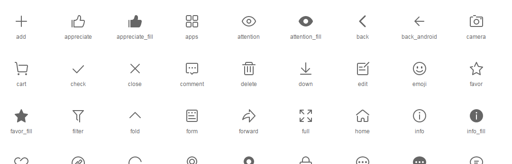

# vui-icon
vue2 svg icon component

# Installation
```
$ npm install vui-icon
```
# Usage
``` xml
<vui-icon name="close"></vui-icon>
```
# Demo
[https://qinshenxue.github.io/vui-icon/](https://qinshenxue.github.io/vui-icon/)
